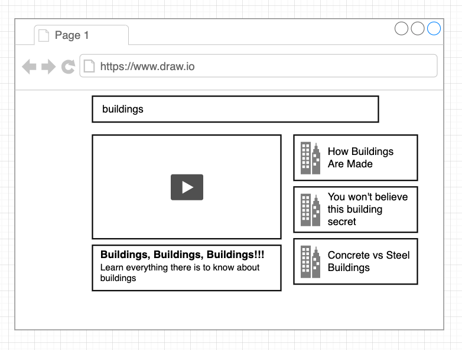

## User Stories
* This is essentially a YouTube browser application in code and approach
* The very top a user is going to enter in some search terms such as in this case I put in buildings for this example.
* They're then going to hit the enter key which is going to trigger a search request rather over to the YouTube public free API 
* With the YouTube API. It’s going to do a search for a list of videos 
* Once I get a list of videos back from this YouTube API I’m going to show them on the right-hand side of the screen.
* A user can then click on one of these videos and will feature it right in the center so the user will see the video appear.
* They can click on a play button and play the video 
* Also, show them a title and a description of the video at the bottom.

## Technologies Used
* React.js
* semantic-ui
* axios
* youtube API

